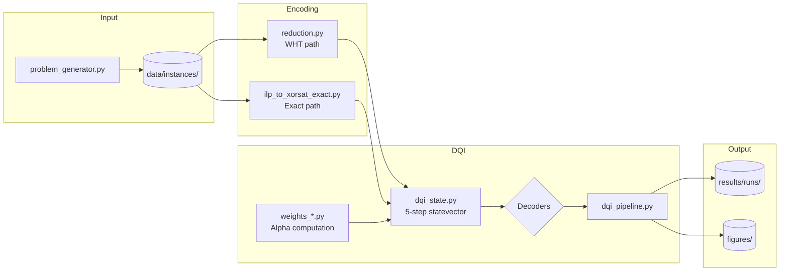
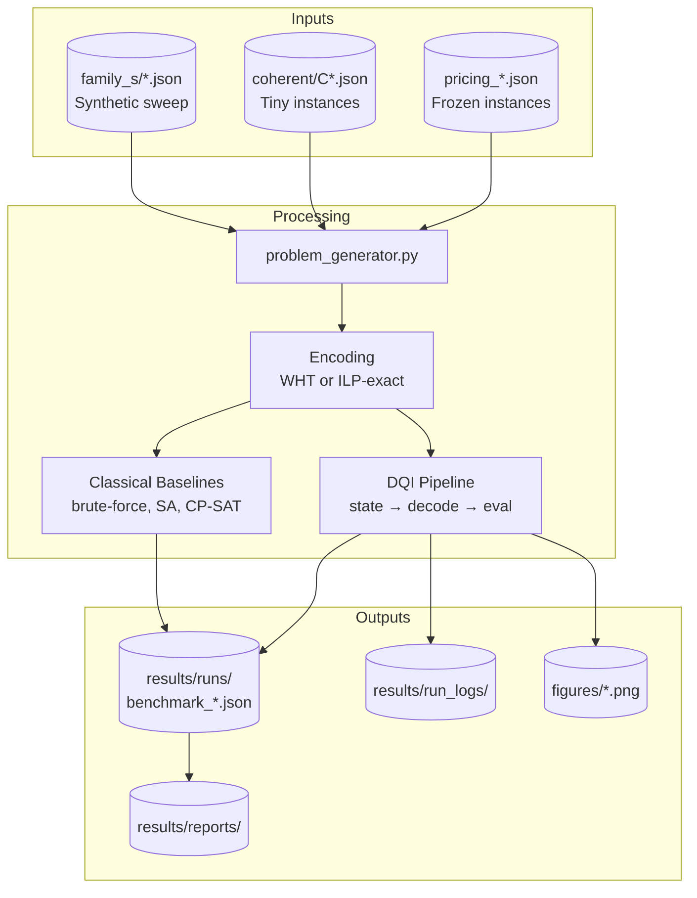
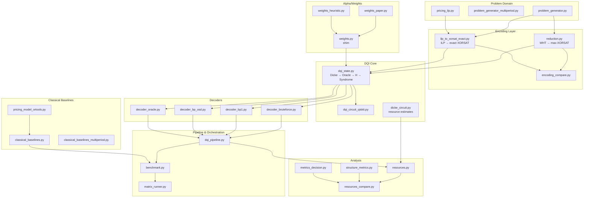
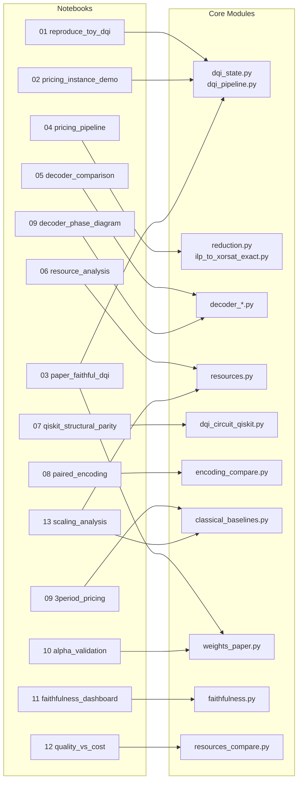

# DQI Pricing Benchmark — File Map

> Benchmark for Decoded Quantum Interferometry (DQI) on discrete vehicle package pricing.
> Based on Jordan et al., "Optimization by Decoded Quantum Interferometry" ([arXiv:2408.08292](https://arxiv.org/abs/2408.08292))

---

# Part 1: Quick Reference

## System Architecture

```
┌─────────────────────────────────────────────────────────────────────┐
│  NOTEBOOKS                                                          │
│  01-13: Interactive exploration, demos, analysis                    │
├─────────────────────────────────────────────────────────────────────┤
│  ORCHESTRATION                                                      │
│  benchmark.py · matrix_runner.py · encoding_compare.py              │
├─────────────────────────────────────────────────────────────────────┤
│  PIPELINE                                                           │
│  dqi_pipeline.py · resources.py · metrics_decision.py               │
├───────────────────────────────┬─────────────────────────────────────┤
│  DQI CORE                     │  CLASSICAL BASELINES                │
│  ├─ dqi_state.py              │  ├─ classical_baselines.py          │
│  ├─ dqi_circuit_qiskit.py     │  ├─ pricing_model_ortools.py        │
│  └─ dicke_circuit.py          │  └─ *_multiperiod.py variants       │
├───────────────────────────────┴─────────────────────────────────────┤
│  DECODERS                                                           │
│  decoder_bruteforce.py · decoder_bp1.py · decoder_bp_osd.py         │
├─────────────────────────────────────────────────────────────────────┤
│  ENCODING                                                           │
│  reduction.py (WHT) · ilp_to_xorsat_exact.py (ILP-derived exact)    │
├─────────────────────────────────────────────────────────────────────┤
│  WEIGHTS / ALPHA                                                    │
│  weights.py · weights_paper.py · weights_heuristic.py               │
├─────────────────────────────────────────────────────────────────────┤
│  PROBLEM DOMAIN                                                     │
│  problem_generator.py · pricing_ilp.py · family_s_generator.py      │
├─────────────────────────────────────────────────────────────────────┤
│  DATA & ARTIFACTS                                                   │
│  data/instances/ · results/runs/ · figures/                         │
└─────────────────────────────────────────────────────────────────────┘
```

---

## Pipeline Flow



---

## Data Flow (Input → Output)



---

## Module Dependencies



---

## Notebook → Module Mapping



---

## Notebook Quick Reference

| # | Name | Purpose | Key Outputs |
|---|------|---------|-------------|
| 01 | `reproduce_toy_dqi` | Canonical DQI reproduction | Histogram figure |
| 02 | `pricing_instance_demo` | Human-readable verification | Instance tables |
| 03 | `paper_faithful_dqi` | Appendix: exact microscope | |
| 04 | `pricing_pipeline` | CP-SAT → surrogate bridge | Artifact export |
| 05 | `decoder_comparison` | BF vs BP1 sensitivity | Decoder metrics |
| 06 | `resource_analysis` | Resource/cost diagnostics | Cost tables |
| 07 | `qiskit_structural_parity` | Qiskit subset checks | Parity report |
| 08 | `paired_encoding_comparison` | ILP-exact vs WHT | Comparison table |
| 09 | `decoder_phase_diagram` | Decoder phase analysis | Phase diagram |
| 09 | `3period_pricing_extension` | Multi-period extension | Extended results |
| 10 | `alpha_finite_size_validation` | Appendix: alpha validation | |
| 11 | `decision_faithfulness_dashboard` | Faithfulness metrics | Dashboard |
| 12 | `quality_vs_cost` | Tradeoff analysis | Pareto plots |
| 13 | `scaling_analysis` | Scaling behavior | Scaling curves |

---

# Part 2: Detailed Reference

## Source Modules (`src/`)

### Core DQI Implementation

| File | Description |
|------|-------------|
| `dqi_state.py` | Five-step DQI statevector preparation implementing Jordan et al. Steps 1-5: Dicke state, phase oracle, Hadamard, syndrome extraction, projection |
| `dqi_pipeline.py` | Full sampling workflow: state prep → decode → evaluate F(x) and G(x), collect metrics |
| `dqi_circuit_qiskit.py` | Structural Qiskit port for hardware-pathway validation; statevector-equivalent, not optimized |
| `dicke_circuit.py` | Analytical resource formulas for Dicke state prep (Bärtschi-Eidenbenz 2019) |

### Problem Domain

| File | Description |
|------|-------------|
| `problem_generator.py` | Discrete vehicle package pricing: N features → 2^N configurations, revenue + penalties |
| `problem_generator_multiperiod.py` | 3-period extension with shared-segment demand shifts |
| `pricing_ilp.py` | Canonical ILP model contract for toy pricing family |
| `pricing_model_ortools.py` | CP-SAT interface — single source of truth for solve semantics |
| `pricing_model_ortools_multiperiod.py` | CP-SAT for 3-period variant |

### Encoding / Reduction

| File | Description |
|------|-------------|
| `reduction.py` | **WHT path**: Walsh-Hadamard transform → top-k Fourier truncation → max-XORSAT surrogate |
| `ilp_to_xorsat_exact.py` | **Exact path**: ILP-derived reference encoding (no approximation) |
| `encoding_compare.py` | Runner for paired WHT vs ILP-exact comparisons |
| `verify_encoding.py` | Stage E validation helpers for encoding correctness |

### Decoders

| File | Method | Use Case |
|------|--------|----------|
| `decoder_bruteforce.py` | Bounded-distance enumeration | Exact reference (m≤20, ℓ≤4) |
| `decoder_bp1.py` | Hard-decision bit-flip | Fast heuristic |
| `decoder_bp_osd.py` | BP + ordered-statistics decoding | Improved heuristic |
| `decoder_oracle.py` | Exact oracle | Tiny instances only |
| `decoder_study_runner.py` | Batch runner | Stage C studies |

### Weights / Alpha

| File | Description |
|------|-------------|
| `weights.py` | Compatibility shim exporting `uniform_weights`, `heuristic_alpha`, `paper_alpha` |
| `weights_paper.py` | Paper-derived finite tridiagonal matrix construction |
| `weights_heuristic.py` | Proxy matrix heuristic (not paper-faithful, for comparison) |
| `alpha_theory_validation.py` | Stage D validation runner on Family C |

### Classical Baselines

| File | Methods |
|------|---------|
| `classical_baselines.py` | Brute-force, CP-SAT (via OR-Tools), simulated annealing |
| `classical_baselines_multiperiod.py` | Same methods for 3-period extension |

### Analysis & Reporting

| File | Description |
|------|-------------|
| `benchmark.py` | Main orchestrator: runs DQI + baselines on frozen instances |
| `matrix_runner.py` | CLI for P/C/S family matrix runs with standardized outputs |
| `resources.py` | DQI resource estimation: gate counts, qubit requirements, depth |
| `resources_compare.py` | Quality-vs-cost join layer (assembles existing outputs) |
| `structure_metrics.py` | Parity system diagnostics: row/column weights, rank, collisions |
| `metrics_decision.py` | Shared decision-quality metrics for comparisons |
| `faithfulness.py` | Stage E faithfulness normalization |
| `report_schema.py` | Schema validators for reporting layer |
| `boundary.py` | Execution-boundary record capture |

### Instance Families

| File | Description |
|------|-------------|
| `coherent_reference.py` | Loader for coherent tiny-instance artifacts (Stage 2A) |
| `family_s_generator.py` | Synthetic structure-sweep generator (density, collision, rank variations) |
| `family_s_manifest.py` | Validator for Family S artifacts |

---

## Data Layout (`data/`)

```
data/
├── instances/
│   ├── pricing_3feat_6bit.json      # Frozen pricing: 3 features → 6 bits
│   ├── pricing_4feat_8bit.json      # Frozen pricing: 4 features → 8 bits
│   ├── pricing_5feat_10bit.json     # Frozen pricing: 5 features → 10 bits
│   ├── pricing_6feat_12bit.json     # Frozen pricing: 6 features → 12 bits
│   ├── pricing_7feat_14bit.json     # Frozen pricing: 7 features → 14 bits
│   ├── surrogate_*.json             # WHT-truncated surrogates
│   ├── coherent/
│   │   ├── C1.json, C1.npz          # Coherent tiny instances
│   │   ├── C2.json, C2.npz
│   │   ├── C3.json, C3.npz
│   │   └── coherent_manifest.json
│   └── family_s/
│       ├── S_dense_low_collision.json
│       ├── S_sparse_high_collision.json
│       ├── S_balanced_rank_full.json
│       ├── ... (8 variants)
│       └── manifest.json
```

---

## Output Layout (`results/`, `figures/`)

```
results/
├── runs/
│   └── YYYYMMDD_HHMMSS/             # Timestamped run outputs
│       ├── benchmark_*.json         # Per-instance results
│       ├── resources_scaling.json
│       └── run_manifest.json
├── run_logs/                        # Execution logs
└── reports/
    └── artifact_index.md

figures/
└── notebook01_toy_histogram.png     # Generated visualizations
```

---

## Tests (`tests/`)

| Pattern | Count | Coverage |
|---------|-------|----------|
| `test_dqi_*.py` | 4 | DQI state, pipeline, coherent modes |
| `test_decoder*.py` | 5 | All decoder variants |
| `test_encoding*.py` | 2 | Encoding paths |
| `test_weights*.py` | 2 | Alpha computation |
| `test_pricing*.py` | 3 | Pricing model, pairing |
| `test_notebook*.py` | 12 | Notebook smoke tests |
| `test_stage_*.py` | 6 | Stage-specific validation |
| `test_resources*.py` | 3 | Resource estimation |
| `test_*_multiperiod.py` | 3 | Multi-period variants |
| Other | ~25 | Baselines, metrics, schema, etc. |

**Total: ~65 test files**

---

## Configuration

| File | Purpose |
|------|---------|
| `pyproject.toml` | Package metadata, dependencies, pytest config |
| `README.md` | Project overview, quick start, disclaimers |
| `Theoretical_Framework.md` | Mathematical foundations |
