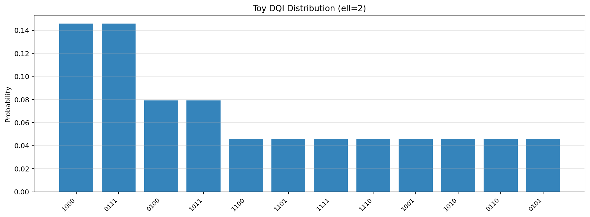

# DQI Pricing Benchmark

Pricing-to-DQI benchmark with exact-reference (ILP-derived) encoding as the mainline path, mixture-mode evaluation as the default execution mode, WHT as an exploratory surrogate, decoder diagnostics, and Qiskit structural subset validation.

## Overview

This benchmark implements:

1. **Pricing benchmark with exact reference artifacts**: discrete vehicle-package pricing with exact ground truth and reviewer-facing `ilp_derived_exact` comparisons
2. **Mixture-mode DQI mainline**: paper-derived alpha and decoder diagnostics on the default reviewer-facing execution path
3. **Exploratory WHT surrogate path**: Walsh-Hadamard truncation used as an explicit exploratory approximation layer
4. **Structural validation utilities**: Qiskit subset checks plus classical baselines for correctness and scope control

**Primary reference**: Jordan et al., "Optimization by Decoded Quantum Interferometry," [arXiv:2408.08292](https://arxiv.org/abs/2408.08292) (2024)

## Key Disclaimers

> **DQI optimizes the surrogate max-XORSAT (G), but all reported objectives are on the true pricing model (F). We report both G(x) and F(x) for transparency.**

> **At this size, classical solvers are exact and faster; this benchmark is about pipeline correctness and paper-faithful implementation, not claiming quantum advantage.**

> **We cap m <= 20 because the DQI error register scales with the number of parity terms.**

## Mainline vs Exploratory

- **Mainline benchmark path**: mixture execution on pricing artifacts with exact-reference / ILP-derived encoding (`ilp_derived_exact`) and decoder diagnostics.
- **Exploratory surrogate path**: WHT-truncated parity artifacts used to study approximation behavior and benchmark transfer.

## Scope Note

- **Mainline**: mixture execution on pricing artifacts with exact-reference / ILP-derived encoding.
- **Exploratory**: WHT-truncated surrogate artifacts.
- **Appendix only**: coherent and alpha finite-size analyses on tiny supported instances.
- **Structural only**: Qiskit subset checks, not decode-inclusive end-to-end parity.

## Implementation Notes

- **Statevector-faithful simplification**: The DQI implementation omits the explicit weight register (weight is inferred from Hamming weight) and uses statevector projection for decoding rather than a reversible circuit. This is suitable for verification at small scale.

- **Heuristic optimal weights**: The "optimal" weight computation uses a simplified heuristic matrix, NOT the exact theorem-derived matrix from Jordan et al. Section 9. This provides a sanity baseline; exact paper-faithful alpha computation is future work.

- **Decoding success probability**: The pipeline reports decoding success probability as a diagnostic. Low success rates indicate collision-heavy syndrome spaces or ell too small for the instance.

## Installation

```bash
pip install -e .

# With Qiskit support
pip install -e ".[qiskit]"
```

## Quick Start

```python
from src.problem_generator import default_instance
from src.dqi_pipeline import DQIPipeline

# Load pricing problem
prob = default_instance()
x_opt, f_opt = prob.brute_force_solve()
print(f"Ground truth: F* = {f_opt:.2f}")

# Run DQI
pipeline = DQIPipeline(prob, k=15, ell=3)
results = pipeline.run_with_metrics(n_samples=1000, seed=42)

print(f"DQI best F: {results['best_F']:.2f}")
print(f"Approx ratio: {results['approximation_ratio']:.4f}")
print(f"Surrogate rho(F,G): {results['spearman_rho']:.4f}")
print(f"Decoding success: {results['success_prob']:.4f}")
```

## Run Benchmarks

```bash
python -m src.benchmark
```

## Notebook Suite

- `notebooks/01_reproduce_toy_dqi.ipynb` — Canonical toy DQI max-XORSAT reproduction with exact reference and knob study.
- `notebooks/02_pricing_instance_demo.ipynb` — Human-readable pricing-model verification on frozen 3/4/5-feature instances.
- `notebooks/04_pricing_pipeline.ipynb` — Pricing-to-DQI bridge: CP-SAT exact solve -> canonical surrogate artifact export.
- `notebooks/08a_paired_encoding_comparison.ipynb` — Reviewer-facing `ilp_derived_exact` versus WHT comparison on paired pricing artifacts (Family P).
- `notebooks/08b_coherent_validation.ipynb` — Coherent execution validation for Family C instances.
- `notebooks/05_decoder_comparison.ipynb` — Brute-force vs BP1 decoder sensitivity with postselection and best-`F` impact diagnostics.
- `notebooks/06_resource_analysis.ipynb` — Resource and cost diagnostics for the reviewer-facing mixture mainline.
- `notebooks/07_qiskit_structural_parity.ipynb` — Structural Qiskit subset checks for the implemented circuit port.
- `notebooks/09_3-period_pricing_extension.ipynb` — Pricing benchmark extension beyond the base frozen instances.
- `notebooks/10_alpha_finite_size_validation.ipynb` — Appendix-only alpha finite-size validation on tiny supported instances.
- `notebooks/03_paper_faithful_dqi.ipynb` — Appendix-only paper-faithful DQI microscope for tiny exact-mode examples.

Notebook 04 requires OR-Tools and intentionally hard-fails if missing because its core purpose is the CP-SAT handoff.

### Notebook 01 Figure



## Default Parameters

| Parameter | Value | Notes |
|-----------|-------|-------|
| Features | 5 | -> n = 10 bits |
| Top-K | 15 | m = 15 surrogate terms |
| ell | 3 | Dicke weight bound |
| Penalties | 50,000 | >> max revenue ~3000 |

## Project Structure

```
dqi-pricing-benchmark/
├── src/
│   ├── problem_generator.py    # Pricing problem + encoding
│   ├── pricing_model_ortools.py # CP-SAT pricing model + standardized solve schema
│   ├── reduction.py            # WHT -> canonical surrogate artifact + compatibility wrappers
│   ├── weights_paper.py        # Paper/demo-facing alpha utilities
│   ├── weights_heuristic.py    # Heuristic alpha utilities
│   ├── weights.py              # Compatibility shim
│   ├── decoder_bruteforce.py   # Bounded-distance decoder
│   ├── decoder_bp1.py          # Deterministic hard-decision bit-flip decoder
│   ├── dqi_state.py            # Five-step DQI statevector
│   ├── dqi_pipeline.py         # Sampling + F/G evaluation
│   ├── classical_baselines.py  # Brute-force, SA
│   ├── benchmark.py            # Orchestration
│   └── dqi_circuit_qiskit.py   # Qiskit port
├── tests/
├── data/instances/             # Frozen JSON instances
├── docs/superpowers/           # Design and implementation plans
└── Theoretical_Framework.md    # Theory reference
```

## License

MIT
