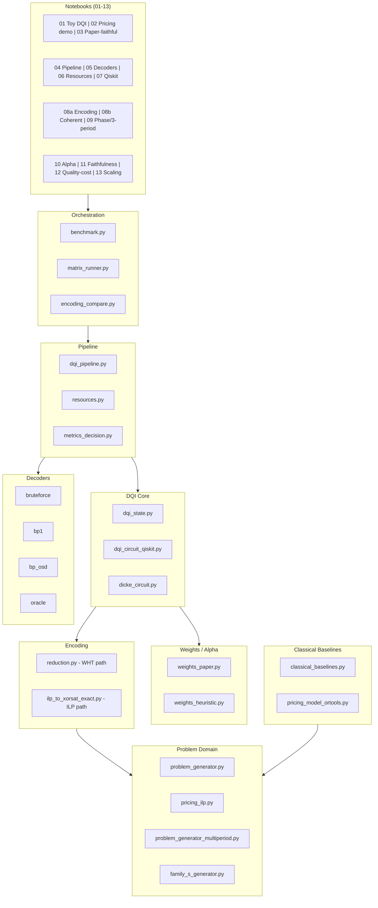
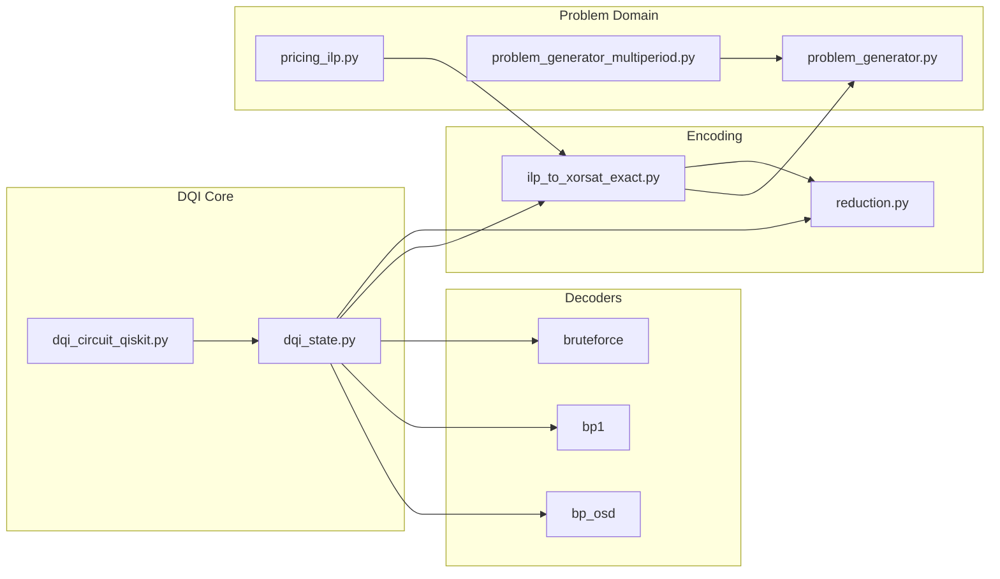

# DQI Pricing Benchmark

Pricing-to-DQI benchmark with exact-reference (ILP-derived) encoding as the mainline path, mixture-mode evaluation as the default execution mode, WHT as an exploratory surrogate, decoder diagnostics, and Qiskit structural subset validation.

## Overview

This benchmark implements:

1. **Pricing benchmark with exact reference artifacts**: discrete vehicle-package pricing with exact ground truth and reviewer-facing `ilp_derived_exact` comparisons
2. **Mixture-mode DQI mainline**: paper-derived alpha and decoder diagnostics on the default reviewer-facing execution path
3. **Exploratory WHT surrogate path**: Walsh-Hadamard truncation used as an explicit exploratory approximation layer
4. **Structural validation utilities**: Qiskit decode-inclusive parity checks plus classical baselines for correctness and scope control
5. **Dynamic pricing extension**: 3-period pricing with shared inventory, time-varying demand, and max-XORSAT sub-problem reduction

**Primary references**:
- Jordan et al., "Optimization by Decoded Quantum Interferometry," [arXiv:2408.08292](https://arxiv.org/abs/2408.08292) (2024); published in *Nature* (2025)
- Sabater et al., [arXiv:2509.08328](https://arxiv.org/abs/2509.08328) (2025) — BMW-BCG industrial DQI pricing

## Key Disclaimers

> **DQI optimizes the surrogate max-XORSAT (G), but all reported objectives are on the true pricing model (F). We report both G(x) and F(x) for transparency.**

> **At this size, classical solvers are exact and faster; this benchmark is about pipeline correctness and paper-faithful implementation, not claiming quantum advantage.**

> **We cap m <= 20 because the DQI error register scales with the number of parity terms.**

## Architecture



## Mainline vs Exploratory

- **Mainline benchmark path**: mixture execution on pricing artifacts with exact-reference / ILP-derived encoding (`ilp_derived_exact`) and decoder diagnostics.
- **Exploratory surrogate path**: WHT-truncated parity artifacts used to study approximation behavior and benchmark transfer.

## Scope Note

- **Mainline**: mixture execution on pricing artifacts with exact-reference / ILP-derived encoding.
- **Exploratory**: WHT-truncated surrogate artifacts.
- **Appendix only**: coherent and alpha finite-size analyses on tiny supported instances.
- **Decode-inclusive Qiskit parity**: verified on P3 and P4 pricing instances (TVD = 0).

## Implementation Notes

- **Statevector-faithful simplification**: The DQI implementation omits the explicit weight register (weight is inferred from Hamming weight) and uses statevector projection for decoding rather than a reversible circuit. This is suitable for verification at small scale.

- **Heuristic optimal weights**: The "optimal" weight computation uses a simplified heuristic matrix, NOT the exact theorem-derived matrix from Jordan et al. Section 9. This provides a sanity baseline; exact paper-faithful alpha computation is future work.

- **Decoding success probability**: The pipeline reports decoding success probability as a diagnostic. Low success rates indicate collision-heavy syndrome spaces or ell too small for the instance.

## Installation

```bash
pip install -e .

# With Qiskit support
pip install -e ".[qiskit]"
```

## Quick Start

```python
from src.problem_generator import default_instance
from src.dqi_pipeline import DQIPipeline

# Load pricing problem
prob = default_instance()
x_opt, f_opt = prob.brute_force_solve()
print(f"Ground truth: F* = {f_opt:.2f}")

# Run DQI
pipeline = DQIPipeline(prob, k=15, ell=3)
results = pipeline.run_with_metrics(n_samples=1000, seed=42)

print(f"DQI best F: {results['best_F']:.2f}")
print(f"Approx ratio: {results['approximation_ratio']:.4f}")
print(f"Surrogate rho(F,G): {results['spearman_rho']:.4f}")
print(f"Decoding success: {results['success_prob']:.4f}")
```

## Run Benchmarks

```bash
python -m src.benchmark
```

## Benchmark Families

| Label | Kind | Definition | Role |
|-------|------|------------|------|
| `P3`-`P7` | Pricing | Frozen pricing instances, 3-7 features (6-14 bits) | Main benchmark ladder |
| `C1`-`C3` | Coherent | Tiny exact-validation artifacts | Faithful DQI correctness checks |
| `S_*` | Structure | Synthetic parity-system instances varying density, rank, collisions | Decoder-phase studies |
| `wht_truncated` | Encoding | Walsh-Hadamard top-k surrogate path | Exploratory reduction path |
| `ilp_derived` | Encoding | Exact ILP-derived pricing-to-XORSAT path | Mainline reviewer-facing encoding |

## Notebook Suite

| # | Notebook | Purpose |
|---|----------|---------|
| 01 | `reproduce_toy_dqi` | Canonical toy DQI max-XORSAT reproduction |
| 02 | `pricing_instance_demo` | Human-readable pricing-model verification |
| 03 | `paper_faithful_dqi` | Appendix: exact microscope on tiny instances |
| 04 | `pricing_pipeline` | CP-SAT exact solve and artifact export |
| 05 | `decoder_comparison` | Brute-force vs BP1 decoder sensitivity |
| 06 | `resource_analysis` | Resource and cost diagnostics |
| 07 | `qiskit_structural_parity` | Qiskit decode-inclusive parity validation |
| 08a | `paired_encoding_comparison` | ILP-exact vs WHT comparison on pricing pairs |
| 08b | `coherent_validation` | Coherent execution validation (Family C) |
| 09 | `decoder_phase_diagram` | Decoder phase analysis across structure regimes |
| 09 | `3period_pricing_extension` | 3-period dynamic pricing with CP-SAT and DQI sub-problem reduction |
| 10 | `alpha_finite_size_validation` | Appendix: alpha finite-size validation |
| 11 | `decision_faithfulness_dashboard` | Faithfulness metrics dashboard |
| 12 | `quality_vs_cost` | Quality-cost tradeoff and Pareto analysis |
| 13 | `scaling_analysis` | Scaling behavior P3-P7 |

Notebook 04 requires OR-Tools and intentionally hard-fails if missing because its core purpose is the CP-SAT handoff.


## Default Parameters

| Parameter | Value | Notes |
|-----------|-------|-------|
| Features | 5 | -> n = 10 bits |
| Top-K | 15 | m = 15 surrogate terms |
| ell | 3 | Dicke weight bound |
| Penalties | 50,000 | >> max revenue ~3000 |

Segment weights for 6-feat and 7-feat instances sum to 1.12 (not 1.0). This is intentional: weights encode relative demand intensity, and the 4th segment extends the base without rescaling.

## Project Structure

```
dqi-pricing-benchmark/
├── src/                                # Source modules (37 .py files)
│   ├── dqi_state.py                    # Five-step DQI statevector preparation
│   ├── dqi_pipeline.py                 # Sampling + F/G evaluation workflow
│   ├── dqi_circuit_qiskit.py           # Qiskit port (structural + decode-inclusive)
│   ├── dicke_circuit.py                # Dicke state resource formulas
│   ├── problem_generator.py            # Pricing problem + 2-bit tier encoding
│   ├── problem_generator_multiperiod.py # 3-period dynamic pricing extension
│   ├── pricing_ilp.py                  # Canonical ILP model contract
│   ├── pricing_model_ortools.py        # CP-SAT exact solver interface
│   ├── pricing_model_ortools_multiperiod.py # CP-SAT for 3-period extension
│   ├── reduction.py                    # WHT -> surrogate artifact (exploratory path)
│   ├── ilp_to_xorsat_exact.py          # ILP -> max-XORSAT exact encoding (mainline)
│   ├── encoding_compare.py             # Paired WHT vs ILP-exact comparison runner
│   ├── verify_encoding.py              # Encoding correctness validation
│   ├── decoder_bruteforce.py           # Bounded-distance decoder (exact reference)
│   ├── decoder_bp1.py                  # Hard-decision bit-flip decoder
│   ├── decoder_bp_osd.py               # BP + ordered-statistics decoding
│   ├── decoder_oracle.py               # Exact oracle (tiny instances only)
│   ├── decoder_study_runner.py         # Decoder batch runner
│   ├── weights_paper.py                # Paper-derived tridiagonal alpha
│   ├── weights_heuristic.py            # Heuristic alpha utilities
│   ├── weights.py                      # Compatibility shim
│   ├── alpha_theory_validation.py      # Finite-size alpha validation runner
│   ├── classical_baselines.py          # Brute-force, CP-SAT, simulated annealing
│   ├── classical_baselines_multiperiod.py # Baselines for 3-period extension
│   ├── benchmark.py                    # Main orchestrator
│   ├── matrix_runner.py                # CLI for P/C/S family matrix runs
│   ├── resources.py                    # DQI resource estimation
│   ├── resources_compare.py            # Quality-vs-cost join layer
│   ├── structure_metrics.py            # Parity-system diagnostics
│   ├── metrics_decision.py             # Decision-quality metrics
│   ├── faithfulness.py                 # Decision-faithfulness normalization
│   ├── report_schema.py                # Schema validators
│   ├── boundary.py                     # Execution-boundary record capture
│   ├── coherent_reference.py           # Coherent tiny-instance loader (C1-C3)
│   ├── family_s_generator.py           # Synthetic structure-sweep generator
│   ├── family_s_manifest.py            # Family S artifact validator
│   └── notebook_utils.py               # Shared notebook helpers
├── notebooks/                          # 15 Jupyter notebooks (see suite above)
│   ├── _helpers.py                     # Shared notebook utilities
│   └── __init__.py
├── tests/                              # 66 test files
├── scripts/                            # Standalone runners and task scripts
│   ├── make_report.py                  # Report generation
│   ├── run_decoder_study.py            # Decoder study runner
│   ├── run_alpha_validation.py         # Alpha validation runner
│   ├── run_ilp_derived_pricing.py      # ILP-derived pricing runner
│   └── task{1-5}_*.py                  # BMW highlight tasks
├── data/
│   └── instances/
│       ├── pricing_{3-7}feat_*.json    # Frozen pricing instances (P3-P7)
│       ├── surrogate_pricing_*.json    # WHT-truncated surrogates
│       ├── coherent/                   # C1-C3 tiny validation instances
│       └── family_s/                   # 8 synthetic structure instances
├── results/                            # Benchmark outputs and task results
│   ├── metrics_master.json             # Canonical execution metrics
│   ├── resources_master.json           # Resource estimation outputs
│   ├── quality_cost_master.*           # Quality-cost join tables
│   ├── runs/                           # Timestamped run outputs
│   ├── paired_pricing/                 # Paired encoding artifacts
│   ├── matrix_{a,b,c}/                 # Matrix run outputs
│   └── task{1-5}_*.{json,csv,md}       # BMW highlight task outputs
├── figures/                            # Generated visualizations
├── docs/                               # Design plans and reports
│   ├── plans/                          # Implementation plans
│   └── superpowers/                    # Design specs
├── Theoretical_Framework.md            # Mathematical foundations
├── DQI_Pricing_Benchmark_Results_and_Validation_Report.md
└── pyproject.toml                      # Package config
```

## Source Modules (`src/`)



